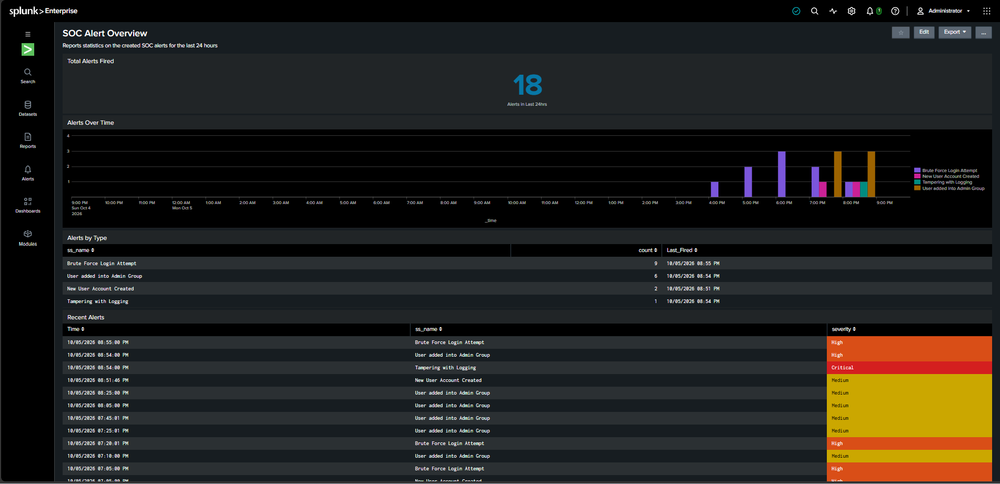
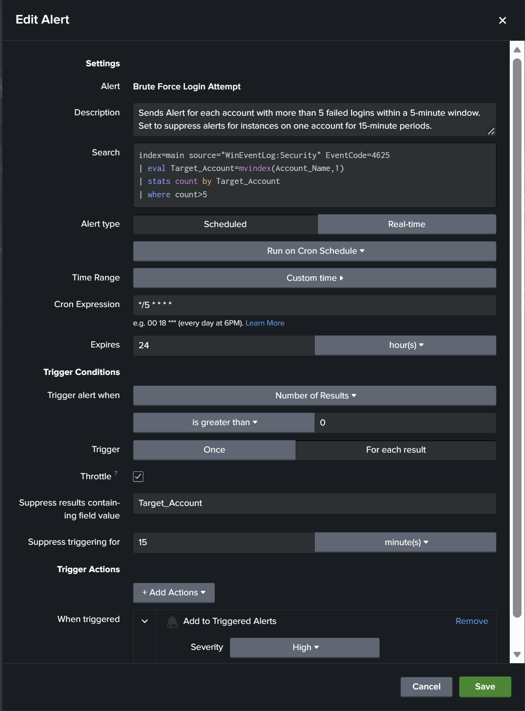
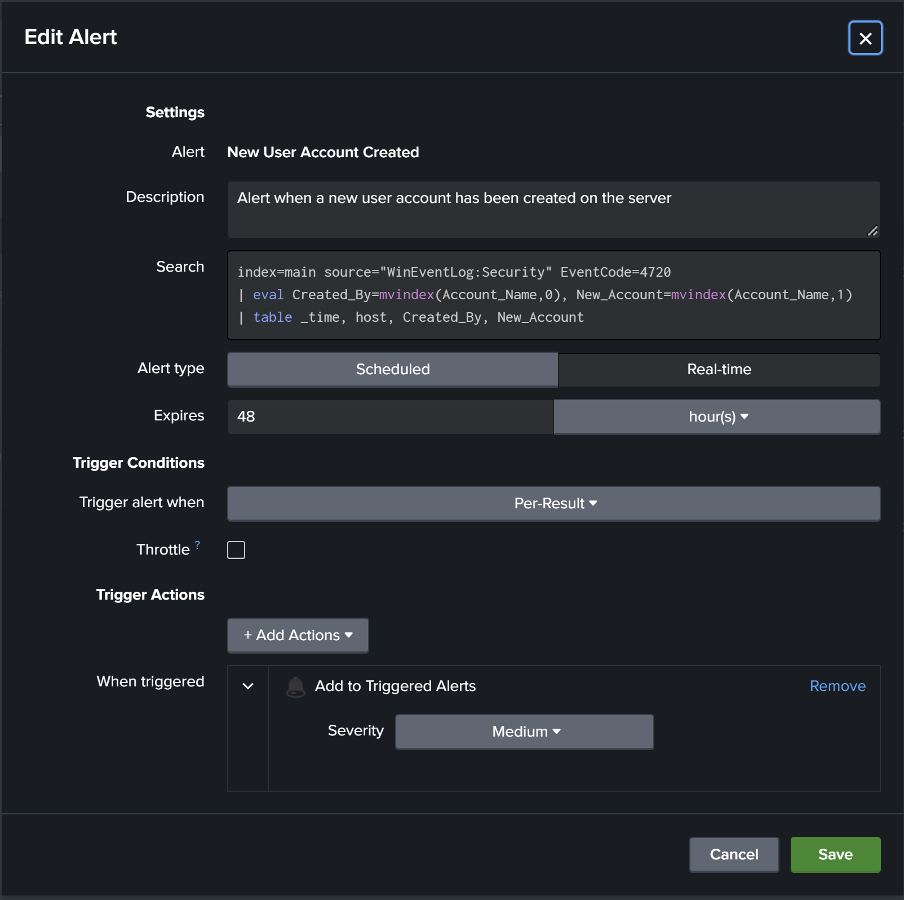
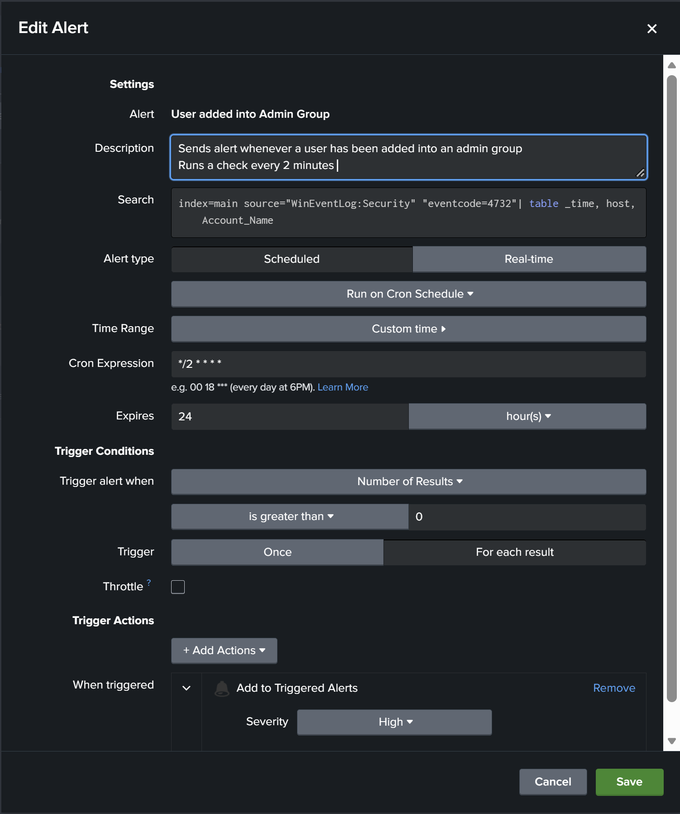
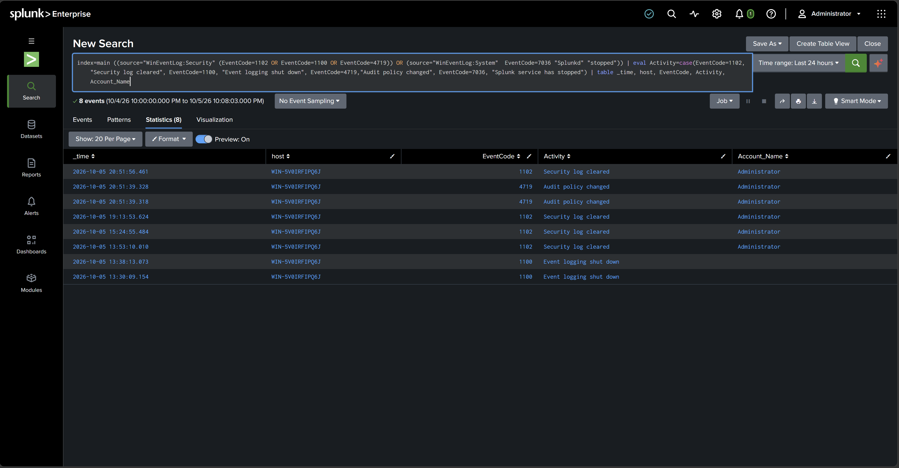
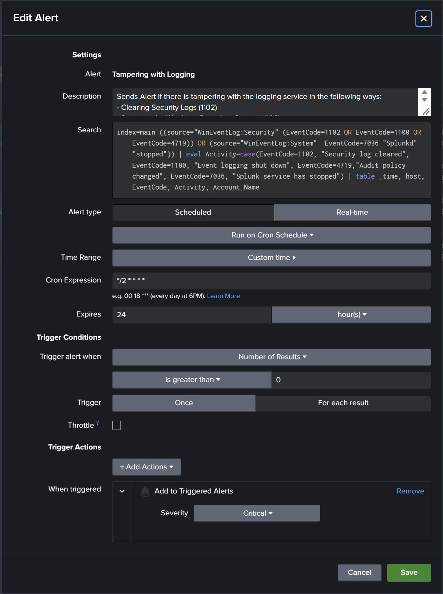
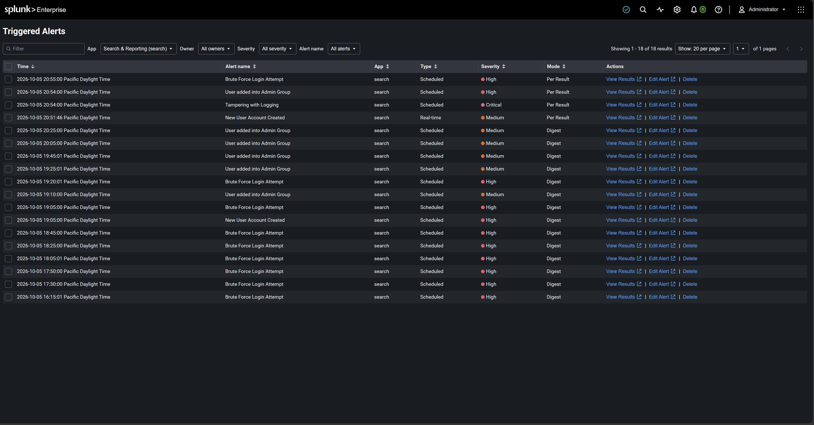

# Splunk-SIEM-Home-Lab

A self-built security monitoring lab using Splunk Enterprise on Windows Server 2022. I deployed Splunk in an isolated virtual environment, ingested Windows event logs, built detection alerts for common attacker techniques, tuned them to avoid duplicate and missed alerts, and created a SOC-style dashboard to track alert activity.

**At a glance**
- 4 detection alerts mapped to MITRE ATT&CK (brute force, account creation, privilege escalation, log tampering)
- Alerts tuned to eliminate duplicates using shifted time windows and per-field throttling
- SOC dashboard tracking alert volume, trends, and severity
- Fully isolated lab built in VMware on Windows Server 2022



---

## Table of Contents

- [Lab Environment](#lab-environment)
- [Detections](#detections)
- [SOC Alert Overview Dashboard](#soc-alert-overview-dashboard)
- [Alert Tuning Decisions](#alert-tuning-decisions)
- [Troubleshooting and Lessons Learned](#troubleshooting-and-lessons-learned)
- [Limitations and Next Steps](#limitations-and-next-steps)
- [Skills Demonstrated](#skills-demonstrated)

---

## Lab Environment

| Component | Details |
|---|---|
| Hypervisor | VMware Workstation |
| Server OS | Windows Server 2022 Standard (Desktop Experience) |
| SIEM | Splunk Enterprise (trial license) |
| VM Resources | 4 vCPU, 8 GB RAM, 100 GB disk |
| Network | Host-only (VMnet1), isolated from the internet and home network |
| Log Sources | Windows Security and System event logs |

The server was kept on a host-only network so it could only communicate with my host PC. Splunk Web was accessed from the host browser at `http://10.10.10.7:8000`.

---

## Detections

| Alert | Event IDs | MITRE ATT&CK | Severity | Type |
|---|---|---|---|---|
| Brute Force Login Attempt | 4625 | T1110 Brute Force | High | Scheduled, every 5 min |
| New User Account Created | 4720 | T1136.001 Create Account: Local Account | Medium | Real-time |
| User Added into Admin Group | 4732 | T1098 Account Manipulation | High | Scheduled, every 2 min |
| Tampering with Logging | 1102, 1100, 4719, 7036 | T1070.001 Clear Windows Event Logs, T1562.002 Disable Windows Event Logging, T1562.001 Disable or Modify Tools | Critical | Scheduled, every 2 min |

### 1. Brute Force Login Attempt

**Purpose:** Detect repeated failed logins against a single account, a common sign of password guessing.

```spl
index=main source="WinEventLog:Security" EventCode=4625
| eval Target_Account=mvindex(Account_Name,1)
| stats count by Target_Account
| where count > 5
```

**How it works:**
- Finds failed logon events (4625)
- Event 4625 contains two account names: the subject that reported the failure (often `-`) and the account being targeted. `mvindex(Account_Name,1)` extracts only the targeted account.
- Counts failures per targeted account and keeps any account with more than 5

| Setting | Value |
|---|---|
| Schedule | `*/5 * * * *` (every 5 minutes) |
| Time range | `-6m@m` to `-1m@m` (a 5-minute window ending 1 minute ago) |
| Trigger | For each result |
| Throttle | 15 minutes, suppressed per `Target_Account` |

**Testing:** Ran `runas /user:<testuser> cmd` and entered an incorrect password 6+ times for multiple test accounts. Each targeted account generated its own alert.



### 2. New User Account Created

**Purpose:** Detect creation of new local accounts, a common persistence technique.

```spl
index=main source="WinEventLog:Security" EventCode=4720
| eval Created_By=mvindex(Account_Name,0), New_Account=mvindex(Account_Name,1)
| table _time, host, Created_By, New_Account
```

**How it works:** Event 4720 lists the account that performed the action first and the newly created account second. The search splits these into two clear columns.

| Setting | Value |
|---|---|
| Type | Real-time |
| Trigger | Per result |
| Throttle | None |

**Testing:** Created test accounts with `net user <testuser> <password> /add`. Each account produced one alert.



### 3. User Added into Admin Group

**Purpose:** Detect privilege escalation through membership in an administrative group.

```spl
index=main source="WinEventLog:Security" EventCode=4732
| table _time, host, Account_Name
```

| Setting | Value |
|---|---|
| Schedule | `*/2 * * * *` (every 2 minutes) |
| Time range | `-3m@m` to `-1m@m` (a 2-minute window ending 1 minute ago) |
| Trigger | For each result |
| Throttle | None, so every admin group change produces its own alert |

**Testing:** Ran `net localgroup Administrators <testuser> /add`.



### 4. Tampering with Logging

**Purpose:** Detect attempts to hide activity by clearing logs, disabling logging, changing audit policy, or stopping Splunk.

```spl
index=main ((source="WinEventLog:Security" (EventCode=1102 OR EventCode=1100 OR EventCode=4719)) OR (source="WinEventLog:System" EventCode=7036 "Splunkd" "stopped"))
| eval Activity=case(EventCode=1102, "Security log cleared", EventCode=1100, "Event logging shut down", EventCode=4719, "Audit policy changed", EventCode=7036, "Splunk service has stopped")
| table _time, host, EventCode, Activity, Account_Name
```

**How it works:**
- Pulls four tampering-related events from two different logs (Security and System)
- Event 7036 is logged for every Windows service, so the search filters for events mentioning both "Splunkd" and "stopped"
- `eval` with `case` adds a plain-English `Activity` column so analysts do not need to memorize event codes

| Event ID | Log | Meaning |
|---|---|---|
| 1102 | Security | Security log was cleared |
| 1100 | Security | Event logging service shut down |
| 4719 | Security | Audit policy was changed |
| 7036 | System | Splunk service stopped (detected after Splunk restarts) |

| Setting | Value |
|---|---|
| Schedule | `*/2 * * * *` (every 2 minutes) |
| Time range | `-3m@m` to `-1m@m` (a 2-minute window ending 1 minute ago) |
| Trigger | For each result |
| Throttle | None, so every tampering event produces its own alert |

**Testing:**
```
wevtutil cl Security
auditpol /set /subcategory:"Logon" /failure:disable
auditpol /set /subcategory:"Logon" /failure:enable
```

The search results below show the Security log being cleared (1102), audit policy changes (4719), and the event logging service shutting down (1100), each labeled with a readable Activity. Clearing the Security log removed the events from Windows, but Splunk had already indexed them, demonstrating why logs should be forwarded to a SIEM.





---

## SOC Alert Overview Dashboard

A dashboard built from Splunk's internal `_audit` index, which records every time an alert fires. It covers the last 24 hours and is shown at the top of this page.

| Panel | Visualization | Purpose |
|---|---|---|
| Total Alerts Fired | Single value | Overall alert volume |
| Alerts Over Time | Column chart | When alerts fired and which ones fired together |
| Alerts by Type | Table | Which alerts fire most, to identify noisy detections |
| Recent Alerts | Table, color-coded by severity | Analyst queue of the latest alerts |

**Total Alerts Fired**
```spl
index=_audit action=alert_fired
| stats count
```

**Alerts Over Time**
```spl
index=_audit action=alert_fired
| timechart span=1h count by ss_name
```

**Alerts by Type**
```spl
index=_audit action=alert_fired
| stats count, latest(_time) as Last_Fired by ss_name
| eval Last_Fired=strftime(Last_Fired, "%m/%d/%Y %I:%M %p")
| sort -count
```

**Recent Alerts**
```spl
index=_audit action=alert_fired
| sort -_time
| eval Time=strftime(_time, "%m/%d/%Y %I:%M:%S %p")
| eval severity=case(severity=1,"Info", severity=2,"Low", severity=3,"Medium", severity=4,"High", severity=5,"Critical")
| table Time, ss_name, severity
```

Severity cells are color-coded (Critical red, High orange, Medium yellow) so high-priority alerts stand out at a glance.

**Triggered Alerts**

Splunk's Triggered Alerts view shows all 18 alerts that fired during testing. The **Mode** column reflects the tuning process: earlier alerts show **Digest** (one alert per check), while the final versions show **Per Result** (one alert per event) after I reconfigured the triggers.



---

## Alert Tuning Decisions

Getting alerts to fire was the first step. Most of the work was making sure each event produced exactly one useful alert.

**Overlapping time windows cause duplicates.** My first versions ran every 5 minutes but looked back 6 minutes, so the last minute of each window was checked twice. One early version even used a 24-hour time range on a 5-minute schedule, which re-alerted on the same event all day. The rule I landed on is *schedule interval ≤ time range ≤ throttle*, so any repeat sighting of the same event falls inside the throttle period.

**Shifted windows remove overlap entirely.** All scheduled alerts now use shifted windows like `-6m@m` to `-1m@m`. Each run checks a fixed slice that ends one minute ago, so windows line up end to end with no gaps or overlap, and late-arriving logs still get caught. `@m` snaps to the start of the minute so windows never drift.

**Trigger "Once" plus a throttle can hide real events.** With Once and a 15-minute throttle, a second, different tampering event within 15 minutes would be suppressed. For the admin group and tampering alerts, where every event matters, I switched to For each result with no throttle.

**Per-field throttling.** Brute force attacks usually continue across many checks. Throttling on `Target_Account` means repeated attempts on the same account are quieted, while a newly targeted account still alerts immediately.

**Scheduled over real-time.** Real-time searches run continuously and are expensive at scale, so I used real-time for one alert to understand it and built the higher-priority detections as frequent scheduled searches instead.

**Severity based on risk and false positive rate.** New account creation is Medium because it is often legitimate admin work. Admin group changes are High because admin rights enable every other attacker action. Log tampering is Critical.

---

## Troubleshooting and Lessons Learned

| Problem | Cause | Fix |
|---|---|---|
| Splunk Web error: `r.toReversed is not a function` | Server shipped with Edge 86, too old for Splunk Web, and the offline VM could not update it | Accessed Splunk from the host PC browser instead |
| VM had a 169.254.x.x address | No DHCP on the host-only network | Assigned a static IP in the VMnet1 subnet |
| Searches returned no results | Field names are case-sensitive (`Account_name` vs `Account_Name`) | Copied exact field names from the Interesting Fields list |
| `"eventcode=4625"` kept appearing in quotes | Accepting Splunk autocomplete suggestions inserted the quoted version | Closed autocomplete with Esc before running searches |
| Lowercase `or` broke a search | Splunk boolean operators must be uppercase | Used `OR` |
| Unbalanced parentheses in the tampering search | Grouping two log sources with `OR` requires each group to be closed separately | Counted opening and closing parentheses and grouped each source on its own |
| Wrong account names in results | Some events contain two account names | Used `mvindex()` to select the correct one |
| Alert fired repeatedly for one event | 24-hour time range on a 5-minute schedule | Matched the time range to the schedule |

---

## Limitations and Next Steps

**Current limitations**
- Splunk runs on the same server it monitors. An attacker with admin rights could stop Splunk before acting. In production, logs are forwarded off the host immediately.
- The Splunk service stop detection (7036) only fires if Splunk restarts quickly. If Splunk is stopped for longer than the alert's time window, the event is collected after restart but its timestamp falls outside the window, so it appears in searches but does not trigger the alert. Detecting an extended outage requires monitoring from a separate system, such as alerting when a host stops sending logs.
- Event 1100 is also logged during normal shutdowns and restarts, so the tampering alert will fire on routine reboots. In production this would be tuned, for example by checking whether a restart event follows shortly after.
- Alerting depends on the Splunk Enterprise trial license.
- Only one host is monitored.

**Planned additions**
- Add a Windows endpoint with the Splunk Universal Forwarder
- Install Sysmon for process creation and PowerShell visibility
- Add firewall and network device logs
- Write a full incident report for one simulated attack

---

## Skills Demonstrated

- Splunk Enterprise deployment and administration
- SPL: `stats`, `timechart`, `eval`, `case`, `mvindex`, `strftime`, `where`, `sort`, `table`
- Windows Security event log analysis
- Detection engineering and alert tuning
- Cron scheduling and time window design
- Dashboard design for SOC workflows
- VMware Workstation virtual networking
- Troubleshooting and documentation
